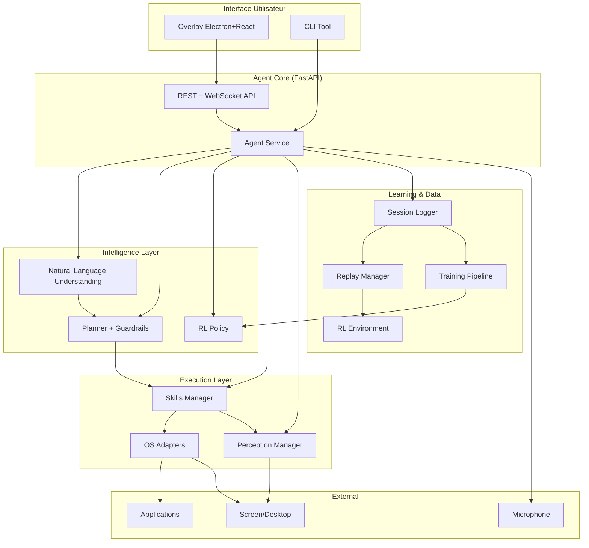
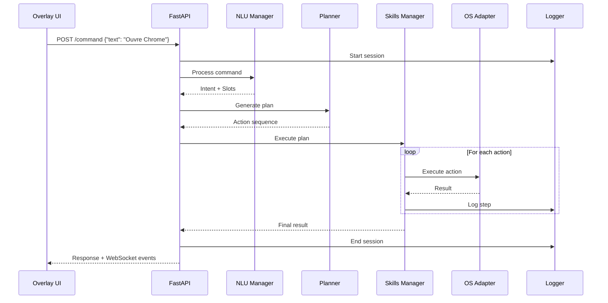
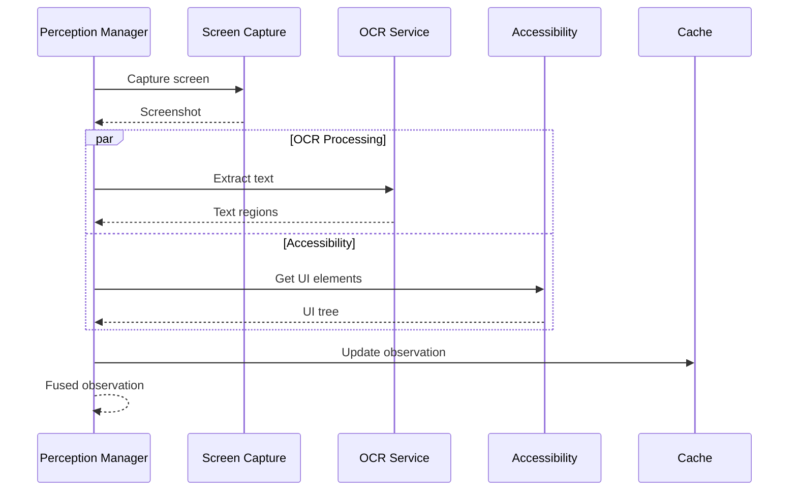

# Architecture détaillée

## Vue d'ensemble

Desktop Agent est conçu comme un système modulaire et extensible pour l'automatisation desktop intelligente. L'architecture suit les principes de séparation des responsabilités, d'extensibilité et de testabilité.

## Diagramme d'architecture



## Couches d'architecture

### 1. Interface Layer

#### Overlay UI (Electron + React)
- **Responsabilité** : Interface utilisateur always-on-top
- **Technologies** : Electron, React, TypeScript, Material-UI
- **Fonctionnalités** :
  - Barre de recherche en bas d'écran
  - Hotkey global (Ctrl+`)
  - Push-to-talk (Alt+Space)
  - Notifications toast
  - Communication avec l'agent via API REST

#### CLI Tool
- **Responsabilité** : Interface en ligne de commande pour debug/admin
- **Fonctionnalités** :
  - Replay de sessions
  - Export de données
  - Création de démonstrations
  - Évaluation de modèles

### 2. API Layer

#### FastAPI Service
- **Responsabilité** : Point d'entrée principal, orchestration
- **Endpoints** :
  - `POST /command` : Exécution de commandes
  - `GET /observation` : État actuel du système
  - `WS /events` : Événements en temps réel
- **Middleware** : Logging, CORS, rate limiting

### 3. Intelligence Layer

#### Natural Language Understanding (NLU)
```python
# packages/nlu/
├── intent_parser.py      # Parsing des intentions
├── slot_extractor.py     # Extraction d'entités
└── nlu_manager.py        # Orchestration NLU
```

**Fonctionnement** :
1. **Intent Classification** : Règles regex pour classifier les intentions
2. **Slot Extraction** : Extraction d'entités nommées (apps, fichiers, etc.)
3. **Normalization** : Normalisation des valeurs extraites

**Intentions supportées** :
- `OPEN_APP` : Ouvrir une application
- `WRITE_FILE` : Créer/écrire un fichier
- `WEB_SEARCH` : Recherche web
- `UNKNOWN` : Intention non reconnue

#### Planner + Guardrails
```python
# packages/planner/
├── plan_generator.py     # Génération de plans d'action
├── guardrails.py         # Vérifications de sécurité
└── planner_manager.py    # Orchestration
```

**Génération de plans** :
1. **Intent → Actions** : Mapping intention vers séquence d'actions
2. **Validation** : Vérification de la faisabilité
3. **Guardrails** : Contrôles de sécurité (fichiers système, permissions)
4. **Confirmation** : Demande de confirmation si nécessaire

#### RL Policy
```python
# packages/policy/
├── baseline_policy.py    # Politique scriptée de base
├── bc_trainer.py         # Behavior Cloning
└── ppo_trainer.py        # PPO training
```

**Politiques disponibles** :
- **Baseline** : Scripts déterministes pour les tâches MVP
- **Behavior Cloning** : Apprentissage par imitation
- **PPO** : Apprentissage par renforcement

### 4. Execution Layer

#### Skills Manager
```python
# packages/skills/
├── base_skill.py         # Interface de base
├── app_skills.py         # open_app, focus_app
├── interaction_skills.py # click_text, type_text
├── file_skills.py        # save_file, write_text_file
└── skill_manager.py      # Orchestration
```

**Architecture des Skills** :
```python
class BaseSkill(ABC):
    @abstractmethod
    async def execute(self, parameters: Dict[str, Any]) -> SkillResult:
        pass
    
    @abstractmethod
    def validate_parameters(self, parameters: Dict[str, Any]) -> bool:
        pass
```

#### Perception Manager
```python
# packages/perception/
├── screen_capture.py     # Capture d'écran multi-moniteurs
├── ocr_service.py        # OCR avec PaddleOCR
├── accessibility_fusion.py # Fusion accessibilité + vision
└── perception_manager.py # Orchestration
```

**Pipeline de perception** :
1. **Screen Capture** : Capture périodique des écrans
2. **OCR Processing** : Extraction de texte
3. **UI Element Detection** : Via APIs d'accessibilité
4. **Fusion** : Combinaison des données

#### OS Adapters
```python
# packages/os_adapters/
├── base.py               # Interface abstraite
├── win/adapter.py        # Windows (UIAutomation)
├── mac/adapter.py        # macOS (stubs)
└── linux/adapter.py      # Linux (stubs)
```

**Interface unifiée** :
```python
class OSAdapter(ABC):
    @abstractmethod
    async def open_app(self, app_name: str) -> bool:
        pass
    
    @abstractmethod
    async def click(self, x: int, y: int) -> bool:
        pass
    
    @abstractmethod
    async def type_text(self, text: str) -> bool:
        pass
```

### 5. Learning & Data Layer

#### Session Logger
```python
# packages/logging_replay/session_logger.py
```

**Fonctionnalités** :
- Logging structuré des sessions (SQLite)
- Sauvegarde des screenshots
- Métadonnées d'exécution
- Hash des observations pour détection de changements

#### Replay Manager
```python
# packages/logging_replay/replay_manager.py
```

**Capacités** :
- Replay de sessions avec visualisation
- Mode dry-run pour validation
- Comparaison de sessions
- Export de données

#### RL Environment
```python
# packages/rl_env/
├── desktop_env.py        # Environnement Gymnasium
├── observation_space.py  # Espace d'observation
└── action_space.py       # Espace d'action
```

**Environnement RL** :
- Compatible Gymnasium
- Observations multi-modales (vision + accessibilité)
- Actions discrètes et continues
- Récompenses basées sur le succès des tâches

## Flux de données

### 1. Flux d'exécution de commande



### 2. Flux de perception



## Patterns d'architecture

### 1. Manager Pattern
Chaque domaine a un manager qui orchestre les composants :
- `NLUManager` : Orchestration NLU
- `PlannerManager` : Génération et validation des plans
- `SkillManager` : Exécution des compétences
- `PerceptionManager` : Fusion des données de perception

### 2. Strategy Pattern
Utilisation de stratégies interchangeables :
- **OS Adapters** : Stratégies par plateforme
- **Policies** : Différents algorithmes de décision
- **Skills** : Implémentations modulaires

### 3. Observer Pattern
Communication par événements :
- WebSocket pour les événements temps réel
- Callbacks pour les étapes d'exécution
- Logging asynchrone

### 4. Command Pattern
Actions encapsulées :
```python
@dataclass
class Action:
    type: ActionType
    parameters: Dict[str, Any]
    timestamp: float
```

## Gestion d'état

### 1. État de session
```python
@dataclass
class ExecutionSession:
    session_id: str
    command: Command
    plan: Plan
    current_step: int
    success: Optional[bool]
    error: Optional[str]
    metadata: Dict[str, Any]
```

### 2. État d'observation
```python
@dataclass  
class Observation:
    timestamp: float
    screenshot_path: str
    ui_elements: List[UiObject]
    ocr_results: List[OCRResult]
    active_window: str
    mouse_position: Tuple[int, int]
    step_count: int
    last_action_success: bool
```

## Configuration

### 1. Configuration hiérarchique
```yaml
# config.yaml
app:
  name: desktop-agent
  version: 0.1.0
  debug: false

api:
  host: 0.0.0.0
  port: 8000
  cors_origins: ["http://localhost:3000"]

skills:
  timeout: 10.0
  retry_attempts: 3
  confirm_dangerous_actions: true

perception:
  screenshot_interval: 1.0
  ocr_enabled: true
  ocr_languages: ["en", "fr"]

logging:
  level: INFO
  file: data/logs/agent.log
  save_screenshots: true
```

### 2. Configuration par environnement
- `config.dev.yaml` : Développement
- `config.prod.yaml` : Production
- `config.test.yaml` : Tests

## Sécurité

### 1. Guardrails
- Validation des chemins de fichiers
- Blocage des actions système dangereuses
- Demande de confirmation pour actions critiques

### 2. Sandboxing
- Limitation des permissions par skill
- Isolation des processus externes
- Validation des entrées utilisateur

### 3. Audit
- Logging complet des actions
- Traçabilité des décisions
- Historique des modifications

## Performance

### 1. Optimisations
- Cache des observations
- Pool de threads pour l'exécution
- Compression des screenshots
- Lazy loading des modèles ML

### 2. Monitoring
- Métriques de performance
- Profiling des opérations lentes
- Alertes sur les erreurs

## Extensibilité

### 1. Plugins
Interface pour ajouter de nouvelles skills :
```python
class CustomSkill(BaseSkill):
    name = "custom_action"
    
    async def execute(self, parameters):
        # Implementation
        pass
```

### 2. Adaptateurs
Ajout de nouveaux OS via l'interface `OSAdapter`

### 3. Politiques
Nouvelles stratégies de décision via l'interface `Policy`

## Tests

### 1. Architecture de test
```
tests/
├── unit/           # Tests unitaires par composant
├── e2e/           # Tests end-to-end avec scénarios
├── performance/   # Tests de performance
└── conftest.py    # Configuration pytest
```

### 2. Mocking
- Mocks pour les APIs système
- Simulations d'environnement
- Données de test synthétiques

Cette architecture modulaire permet une évolution progressive du système tout en maintenant la stabilité et la testabilité.